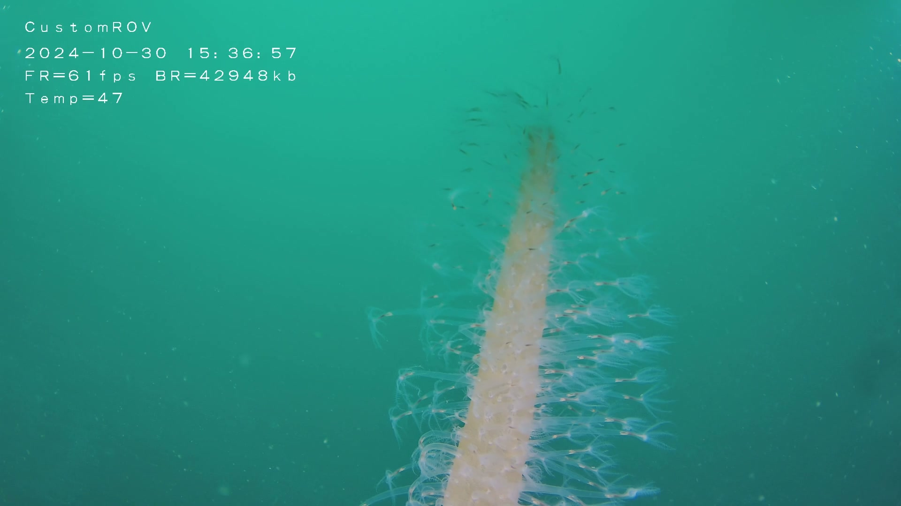

# 🤖 ROV AI Video Analyzer

Automated underwater ROV inspection analysis using AI vision models. Detects defects, generates PDF reports, and sends to Telegram for approval.


---

## 📋 About

**ROV (Remotely Operated Vehicle)** inspection is critical for underwater infrastructure—pipelines, offshore platforms, seabed installations need regular monitoring for corrosion, damage, or marine growth.

### Why This Tool?

Traditional ROV inspection involves:
- Recording hours of underwater video 📹
- Manual review (slow, expensive, inconsistent) 👀
- Human fatigue → missed defects ⚠️

This tool **automates** the analysis:
- AI vision models detect defects automatically
- Consistent, objective assessment every time
- PDF reports ready for stakeholders
- Telegram integration for mobile approval

### Who Is This For?

| User | Use Case |
|------|----------|
| **ROV Operators** | Auto-analyze dive footage on the boat |
| **Inspection Companies** | Scale from 2 inspections/day → 20 |
| **Engineers** | Get PDF reports for integrity assessment |
| **Marine Scientists** | Catalog marine life & habitat conditions |

### Key Capabilities

- **Automated Frame Extraction** — OpenCV pulls keyframes from video (motion/edge/feature detection)
- **AI-Powered Analysis** — Gemini vision models analyze each frame for defects, marine life, environment
- **PDF Report Generation** — Professional inspection reports with images, timestamps, assessments
- **Telegram Integration** — Get notifications + approve reports directly from your phone
- **Folder Watching** — Runs 24/7, auto-detects new videos and processes them

### Technical Stack

| Component | Technology |
|-----------|------------|
| Video Processing | OpenCV (Python) |
| AI Vision | Gemini via OpenRouter |
| PDF Generation | FPDF (fpdf2) |
| Notifications | Telegram Bot API |
| Deployment | Windows (scheduled task) / Linux (cron) |

---

## 📸 Overview

This tool automates ROV (Remotely Operated Vehicle) underwater video inspection:

```
📹 ROV Video → 🎞️ Extract Frames → 🧠 AI Analysis → 📊 PDF Report → 📱 Telegram Approval
```

### What It Does

| Feature | Description |
|---------|-------------|
| **Auto-Detection** | Watches folder for new videos automatically |
| **AI Vision** | Uses Gemini/Claude for frame analysis |
| **PDF Reports** | Generates professional inspection reports |
| **Telegram Bot** | Sends notifications and reports for approval |
| **Motion & Feature Detection** | OpenCV flags important frames (motion, edges, features) |

---

## 🏗️ How It Works

```
ROV Video File
      │
      ▼
┌─────────────────┐
│  rov_watcher.py │  ← Monitors folder for new videos
└────────┬────────┘
         │
         ▼ OpenCV: Extracts frames + Flags important ones (motion, edges, features)
┌─────────────────┐
│  frames/        │  ← Saved to D:\ROV_Jobs\job_name\frames\
└────────┬────────┘
         │
         ▼ AI analyzes each frame
┌─────────────────┐
│  rov_analyzer.py│  ← Sends to Gemini vision API
└────────┬────────┘
         │
         ▼ Generates report
┌─────────────────┐
│  PDF Report     │  ← Saved to D:\ROV_Reports\
└────────┬────────┘
         │
         ▼ Notifies you
┌─────────────────┐
│  Telegram Bot   │  ← Sends notification + PDF
└─────────────────┘
```

### Two Modes

| Mode | File | What it does |
|------|------|--------------|
| **Auto** | `rov_watcher.py` | Watches folder 24/7, auto-detects new videos |
| **Manual** | `rov_analyzer.py` | Analyze specific job folder on demand |

---

## ⚡ Quick Start

# 3. Install dependencies
pip install -r requirements.txt

# 4. Configure
copy .env.example .env
# Edit .env with your settings (see below)

# 5. Run!
python rov_watcher.py
```

That's it! 🎉

---

## ⚙️ Configuration

### Step 1: Get API Keys

**OpenRouter API Key** (for AI analysis)
1. Go to https://openrouter.ai/
2. Sign up and get free API key
3. Recommended model: `google/gemini-2.5-flash-lite` (fast & cheap)

**Telegram Bot** (for notifications)
1. Message @BotFather on Telegram
2. Send `/newbot` and follow instructions
3. Save your bot token
4. Start a chat with your bot
5. Get your Chat ID: https://t.me/userinfobot

### Step 2: Edit `.env` File

```env
# ===========================================
# REQUIRED - AI & Telegram
# ===========================================
OPENROUTER_API_KEY=xxxx
TELEGRAM_BOT_TOKEN=123456789:ABCdefGHIjklMNOpqrsTUVwxyz
TELEGRAM_CHAT_ID=xxxx

# ===========================================
# FOLDERS - Adjust to your setup
# ===========================================
WATCH_FOLDER=D:\ROV_Videos      # Where ROV videos are saved
OUTPUT_FOLDER=D:\ROV_Jobs       # Where to save processed jobs
REPORTS_FOLDER=D:\ROV_Reports  # Where to save PDF reports

# ===========================================
# AI MODEL (usually don't need to change)
# ===========================================
MODEL_ID=google/gemini-2.5-flash-lite

# ===========================================
# OPTIONS
# ===========================================
FRAME_EVERY_SEC=5              # Extract frame every X seconds
VERIFICATION_MODE=false        # true = only 5 frames (testing)
APPROVAL_TIMEOUT_SEC=600      # 10 minutes for telegram approval
```

---

## 📖 Usage

### Mode 1: Watch Mode (Recommended)

Monitors your video folder automatically. Runs 24/7.

```bash
python rov_watcher.py
```

**What happens:**
1. Detects new video in `WATCH_FOLDER`
2. Extracts frames (every 5 seconds by default)
3. Saves to `OUTPUT_FOLDER/job_name/frames/`
4. Creates `job_meta.json`
5. Runs AI analysis
6. Generates PDF report
7. Sends to Telegram

### Mode 2: Manual Analysis

Analyze a specific job folder.

```bash
# Analyze latest job
python rov_analyzer.py

# Analyze specific job
python rov_analyzer.py D:\ROV_Jobs\my_job_20240315
```

### Mode 3: Test Mode

Run with only 5 frames to test setup.

```bash
VERIFICATION_MODE=true python rov_analyzer.py
```

---

## 📁 Project Structure

```
rov-ai-analyzer/
├── rov_watcher.py         # Folder watcher - auto-detect videos
├── rov_analyzer.py        # AI analyzer - process frames
├── requirements.txt       # Python dependencies
├── .env.example           # Configuration template
├── examples/              # Example outputs
│   ├── job_output/        # Sample job data
│   └── README.md          # Example documentation
├── README.md              # This file
├── CONTRIBUTING.md        # How to contribute
├── .gitignore             # Git ignore patterns
└── LICENSE                # MIT License
```

---

## 📊 Example Output

See the `examples/` folder for sample outputs.

### Input → Output Flow

| Step | Description | Example |
|------|-------------|---------|
| 1. Video | ROV records video | `video.mp4` (500MB) |
| 2. Frames | Extract every 5 seconds | 50 frames extracted |
| 3. Metadata | Save job info | `job_meta.json` |
| 4. Analysis | AI processes frames | `sample_analysis.txt` |
| 5. Report | Generate PDF | `job_report.pdf` |

### Sample Job Structure

After running, you'll get:

```
ROV_Jobs/
└── 20260115_143022_sample/
    ├── job_meta.json          # Processing info
    ├── all_frames/            # All extracted frames
    │   ├── frame_00001.jpg
    │   └── frame_00002.jpg
    └── flagged_frames/        # Important frames (AI selected)
        ├── frame_00001.jpg
        └── frame_00004.jpg

ROV_Reports/
└── 20260115_143022_sample_report.pdf  # Final report
```


### Sample AI Analysis

<p align="center">
  
  <br>
  <em>sea pen</em>
</p>

---

**Frame:** `frame_00009.jpg` (Flagged)  
**Condition:** GOOD  

**Objects:** sea pen  

**Detail:**  
A large, creamy-colored sea pen stalk is prominently featured, covered in numerous small white polyps resembling tiny starbursts. Several dark, slender brittle stars are visible on the sandy seabed and along the edges of the frame, with their arms extended.

**Environment:**  
Seabed: sandy with shell fragments and sparse red algae  
Depth (est.): 5–10 m  
Water: good light penetration and visibility  
Clarity: clear  

**Assessment:**  
Urgency: low  
Remarks: typical benthic marine life observed, no immediate concerns  

**Summary:**  
Sea pen with surrounding brittle stars on a stable sandy seabed.


## 🔧 Troubleshooting

### "No frames extracted"
- Check video file is in correct format (.mp4, .avi, .mkv, .mov)
- Verify `WATCH_FOLDER` path exists

### "API key not working"
- Make sure `OPENROUTER_API_KEY` is set in `.env`
- Check you have credits at openrouter.ai

### "Telegram not sending"
- Verify bot token is correct
- Make sure you've started a chat with your bot
- Check `TELEGRAM_CHAT_ID` is numeric

### "Permission denied"
- On Windows, run as Administrator
- Check folder write permissions

---

## ❓ FAQ

### Q: What video formats are supported?
A: `.mp4`, `.avi`, `.mkv`, `.mov` — any format OpenCV can read.

### Q: How does the AI know what to look for?
A: The prompt instructs Gemini to identify: structural defects, marine growth, corrosion, anomalies, marine life, and environmental conditions. You can customize the prompt in `rov_analyzer.py`.

### Q: Can I run this on a server without a GUI?
A: Yes! The tool runs headless. Just configure the folders and API keys, then run via CLI or cron.

### Q: How much does it cost to run?
A: Roughly $0.002-0.005 per frame analyzed (Gemini Flash Lite). A 10-minute video @ 5 sec intervals = ~120 frames = ~$0.24/job.

### Q: Can I use a different AI model?
A: Yes! Change `MODEL_ID` in `.env`. Works with any OpenRouter-supported vision model.

### Q: What if the AI misses something?
A: Use `APPROVAL_TIMEOUT_SEC` in `.env` to enable manual review. Telegram bot waits for your approval before finalizing. Set to 0 to auto-approve.

---

## 🤝 Contributing

## 📄 License

MIT License - see [LICENSE](LICENSE)

---

## 👤 Author

- ryaan
- GitHub: [ryan354](https://github.com/ryan354)
- Email: ryaan354@gmail.com

---

## 🙏 Acknowledgments

- [OpenRouter](https://openrouter.ai/) - AI API
- [FPDF](https://pyfpdf.github.io/fpdf2/) - PDF generation
- [OpenCV](https://opencv.org/) - Video processing
